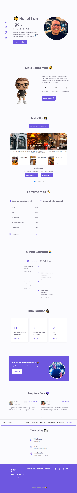

<!--
  Commit message:
:house: igorlazzaretti.com
 -->

## Meu Site-Portfólio
<a target="_blank" href="https://igorlazzaretti.com">👨‍💻 Acesse o Site Aqui</a>

🚀 Estou emocionado em compartilhar que finalizei meu próprio site portfolio como desenvolvedor iniciante! 🌟 Este projeto representa não apenas horas de dedicação e aprendizado, mas também meu compromisso comigo mesmo!

Projeto com tecnologias HTML, CSS (Unicoins + Swipper + AOS Scroll + Animate.css) e Javascript.

Este site-portfólio foi construído inspirado no projeto de <a href="https://github.com/jose-bone/responsive-portfolio-website">Jose Bone</a>.

## Imagem Prévia

## Tecnologias Utilizadas

  &nbsp;
  &nbsp;
  &nbsp;

## Sobre o Autor

🎓 Análise de Sistemas - Cruzeiro do Sul  
💻 Estudante FullStack: DevClub  
👩🏻‍💻 Autor do Site: <a href="https://igorlazzaretti.com/">igorlazzaretti.com</a>  
📚 Leitor e Estudante de Inglês  
💚 Juventudista e 🧙‍♂️ Fã de Harry Potter   

<!-- Social Banners -->

##

> "Acredite nos seus sonhos"   - Igor Dossin Lazzaretti

