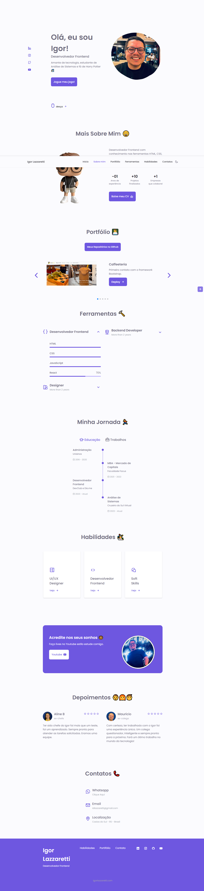

## Meu Site-Portfólio
<a target="_blank" href="https://igorlazzaretti.github.io/caffeeteria-bootstrap-dio.me/">👨‍💻 Deploy do Projeto</a>

Projeto com tecnologias HTML, CSS (Unicoins + Swipper) e Javascript.

Este site-portfólio foi construído inspirado no projeto de <a href="https://github.com/jose-bone/responsive-portfolio-website">Jose Bone</a>.

## Imagem

## Tecnologias Utilizadas
-   HTML 5
-   CSS 3
-   Bootstrap

## Sobre o Autor

📠Análise de Sistemas - Cruzeiro do Sul  
💻 Estudante FullStack: Dio.me / DevClub  
👩🏻‍💻 Autor do Site: <a href="https://igorlazzaretti.com/">igorlazzaretti.com</a>  
📚 Leitor e Estudante de Inglês   
💚 Juventudista e 🧙‍♂️ Fã de Harry Potter    

##

> "Acredite nos seus sonhos"   - Igor Dossin Lazzaretti

