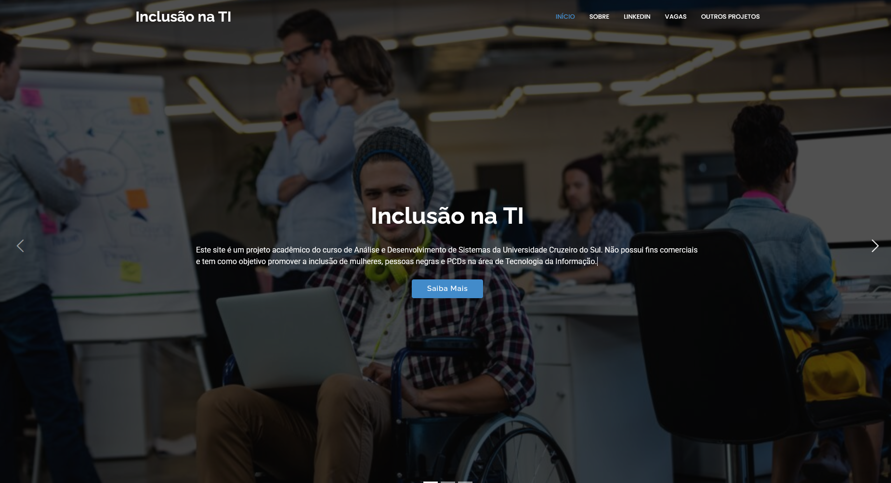
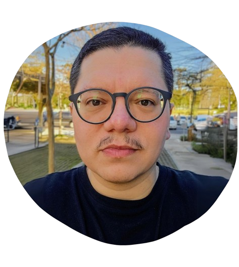

##

   

## Sobre o Projeto

Este é um projeto acadêmico do curso de Análise e Desenvolvimento de Sistemas da Universidade Cruzeiro do Sul. Não possui fins comerciais e tem como objetivo promover a inclusão de mulheres, pessoas negras e PCDs na área de Tecnologia da Informação.

## Tecnologias Utilizadas

  &nbsp;
  &nbsp;
  &nbsp;
  &nbsp;

## Sobre o Desenvolvedor

🎓 Análise de Sistemas - Cruzeiro do Sul  
💻 Estudante FullStack: DevClub  
👩🏻‍💻 Autor do Site: <a href="https://igorlazzaretti.com/" style="color:pink">igorlazzaretti.com</a>  
📚 Leitor e Estudante de Inglês  
🧙‍♂️ Fã de Harry Potter   

##

   

> "Ninguém pode ajudar todo mundo, mas todo mundo pode ajudar alguém. "   - Desconhecido

